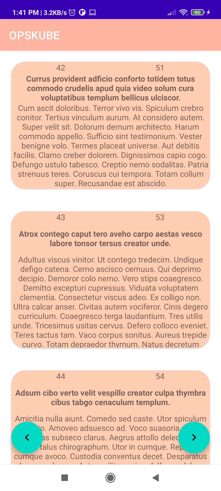

# opskube
<a href="https://photos.google.com/photo/AF1QipNfEs-uBZSSkyKbyPy0ys7LN_XOtsNHQ0GyMzeF">ScreenRecording</a>
 

By default the first blog page is loaded along with the ids ,title and body .  At bottom previous and next buttons are placed to navigate to the different pages.

<h4> > next button </h4>
<h4> < previous button </h4>

